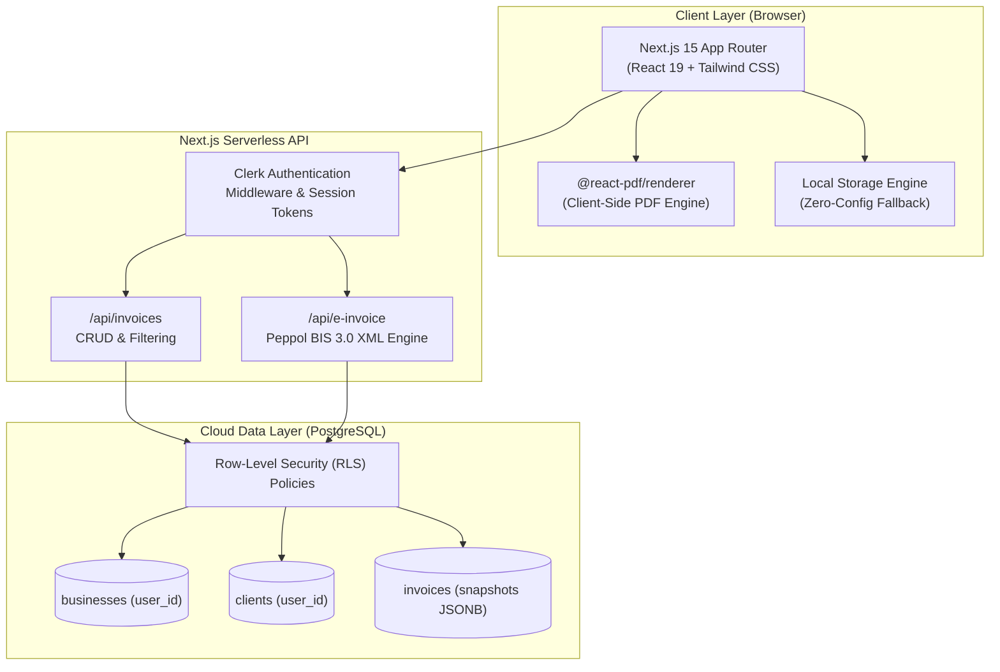

# ⚡ BillPulse - Commercial Invoicing & Billing SaaS

<p align="center">
  
  
  
  
  
  
</p>

---

## 📌 About BillPulse

**BillPulse** is a modern, high-performance, multi-tenant invoicing and billing SaaS platform engineered for freelancers, contractors, and agencies. 

Originally modernized and evolved from the open-source `invoice-builder` engine, BillPulse transforms traditional document generation into a cloud-ready, enterprise-grade financial workflow featuring **zero-server CPU PDF rendering**, **European Peppol BIS Billing 3.0 / UBL 2.1 legal compliance**, and **multi-tenant PostgreSQL security**.

> [!NOTE]
> **Source Code Privacy Notice:**  
> The core production codebase is hosted in a private repository for commercial and IP protection. This public repository serves as the **Public Architecture Showcase & Documentation Hub**.

---

## 🚀 Key Architectural Highlights

### 1. ⚡ Zero-Server-Cost PDF Engine
Traditional PDF generation platforms rely on headless Chromium (e.g. Puppeteer) on serverless instances, which leads to heavy CPU utilization, cold starts, and steep hosting bills.  
* BillPulse executes PDF generation **100% on the client's browser** via `@react-pdf/renderer`.
* **$0 server compute cost** per invoice generated.
* Instant generation with zero network lag or cold starts.

### 2. 🇪🇺 European E-Invoicing Legal Compliance (Peppol BIS 3.0 & UBL 2.1)
The European Union mandates structured electronic invoicing for B2G and B2B transactions.
* Full XML serialization compliant with **Peppol BIS Billing 3.0** and **UBL 2.1** standards.
* Generates legal endpoints including Buyer/Seller VAT IDs, Peppol Endpoint Scheme Identifiers, Tax Subtotals, and Item Classifications.
* Available via both client-side download and serverless REST API endpoints (`/api/e-invoice`).

### 3. 🛡️ Multi-Tenant Architecture with Row-Level Security (RLS)
* Built on PostgreSQL (Supabase / Neon) with strict tenant isolation using `user_id`.
* Every invoice, client, item, and organization is protected by Postgres RLS policies, preventing cross-tenant data leaks.
* **Immutable Snapshot Preservation:** Invoices store historical client details and business profiles in JSONB snapshots, ensuring past invoices remain legally valid and uncorrupted even when customer details change.

### 4. 🎨 Split-Screen Real-Time Invoice Studio
* **Two-Column Interactive Workspace:** Left-hand form inputs instantly mirror to a high-fidelity, printable **A4 paper sheet** (`shadow-2xl`) on the right with sub-millisecond latency.
* **Live Theme Engine:** Switch branding palettes (Indigo, Emerald, Teal, Rose, Slate, Amber) with instant CSS variable updates.
* **Interactive Watermarking:** Dynamic toggle for **PAID** stamps.
* **Confetti Celebration:** Multi-cannon celebration upon invoice issuance with one-click download modals.

---

## 🏛️ System Architecture



---

## 💻 Tech Stack & Infrastructure

| Layer | Technology | Purpose |
| :--- | :--- | :--- |
| **Framework** | **Next.js 15.2 (App Router)** | Hybrid serverless API routes and React Server Components |
| **Language** | **TypeScript 5.7** | Strict domain modeling for monetary math and data structures |
| **Styling** | **Tailwind CSS 3.4** | Design tokens, responsive layouts, and print-ready styles |
| **PDF Generation** | **`@react-pdf/renderer`** | Client-side zero-CPU document composition |
| **Database** | **PostgreSQL (Supabase / Neon)** | Multi-tenant schema with RLS and JSONB snapshots |
| **Authentication** | **Clerk** | Secure identity, JWT sessions, and organization switching |
| **E-Invoicing** | **Peppol BIS 3.0 / UBL 2.1** | Standardized XML generation for EU compliance |
| **Icons & UI** | **Lucide React & Canvas-Confetti** | Modern micro-interactions and celebration animations |

---

## 🗄️ Database Schema & Data Models

The core database design enforces multi-tenancy at the engine level:

```sql
-- Multi-Tenant Invoices Table (Excerpt from lib/db/schema.sql)
CREATE TABLE invoices (
  id UUID PRIMARY KEY DEFAULT gen_random_uuid(),
  user_id VARCHAR(255) NOT NULL,
  client_id UUID REFERENCES clients(id) ON DELETE SET NULL,
  invoice_number VARCHAR(50) NOT NULL,
  issue_date DATE NOT NULL,
  due_date DATE NOT NULL,
  status VARCHAR(20) DEFAULT 'draft' CHECK (status IN ('draft', 'sent', 'paid', 'overdue', 'cancelled')),
  currency VARCHAR(10) DEFAULT 'USD',
  subtotal NUMERIC(12, 2) NOT NULL DEFAULT 0.00,
  tax_rate NUMERIC(5, 2) DEFAULT 0.00,
  tax_amount NUMERIC(12, 2) NOT NULL DEFAULT 0.00,
  discount_rate NUMERIC(5, 2) DEFAULT 0.00,
  discount_amount NUMERIC(12, 2) NOT NULL DEFAULT 0.00,
  shipping_fee NUMERIC(12, 2) DEFAULT 0.00,
  total_amount NUMERIC(12, 2) NOT NULL DEFAULT 0.00,
  client_snapshot JSONB,    -- Preserves historical client data
  business_snapshot JSONB,  -- Preserves historical issuer data
  created_at TIMESTAMPTZ DEFAULT NOW(),
  updated_at TIMESTAMPTZ DEFAULT NOW()
);

-- Row-Level Security
ALTER TABLE invoices ENABLE ROW LEVEL SECURITY;
CREATE POLICY "Users can only access their own invoices"
  ON invoices FOR ALL
  USING (user_id = auth.uid());
```

---

## 📖 Deep-Dive Documentation

For detailed architectural decisions, trade-offs, and compliance breakdowns, read:
* **[ARCHITECTURE.md](./ARCHITECTURE.md)** — In-depth architectural analysis (Client PDF vs Headless Chrome, Peppol BIS 3.0 XML validation, RLS design).

---

## 👤 Author & Inquiries

* **Developer:** [Magraa](https://github.com/Magraa)
* **Email:** [agrawalmayank1111@gmail.com](mailto:agrawalmayank1111@gmail.com)

*For commercial licensing, enterprise customizations, or source access inquiries, please reach out via email.*
